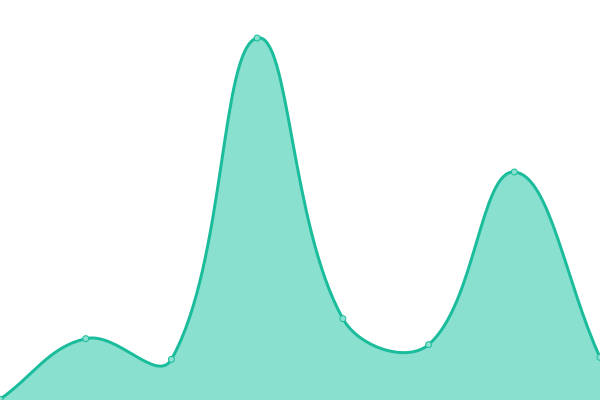
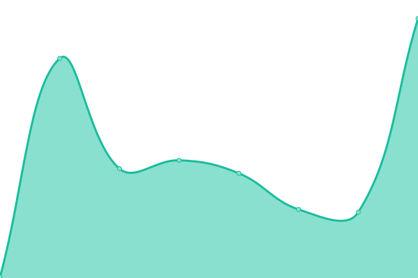

# [ Live Status&nbsp;&nbsp;&nbsp;&nbsp;](https://status.tonicpow.com) <!--live status--> **🟩 All systems operational**

> Uptime monitor and status page for [TonicPow](https://tonicpow.com/?utm_source=github&utm_medium=github_repo&utm_campaign=status&utm_term=status&utm_content=status)

 

 
 

<!--start: status pages-->
<!-- This summary is generated by Upptime (https://github.com/upptime/upptime) -->
<!-- Do not edit this manually, your changes will be overwritten -->
<!-- prettier-ignore -->
| URL | Status | History | Response Time | Uptime |
| --- | ------ | ------- | ------------- | ------ |
|  API | 🟩 Up | [api.yml](https://github.com/tonicpow/status/commits/HEAD/history/api.yml) | 

 213ms
     
 | 

<a href="https://status.tonicpow.com/history/api">100.00%</a>
    

|  [Documentation](https://docs.tonicpow.com) | 🟩 Up | [documentation.yml](https://github.com/tonicpow/status/commits/HEAD/history/documentation.yml) | 

 730ms
     
 | 

<a href="https://status.tonicpow.com/history/documentation">100.00%</a>
    

|  Short-Link Service | 🟩 Up | [short-link-service.yml](https://github.com/tonicpow/status/commits/HEAD/history/short-link-service.yml) | 

 180ms
     
 | 

<a href="https://status.tonicpow.com/history/short-link-service">100.00%</a>
    

|  [Website (Hosting)](https://tonicpow.com) | 🟩 Up | [website-hosting.yml](https://github.com/tonicpow/status/commits/HEAD/history/website-hosting.yml) | 

 218ms
     
 | 

<a href="https://status.tonicpow.com/history/website-hosting">100.00%</a>
    

|  Website (Server) | 🟩 Up | [website-server.yml](https://github.com/tonicpow/status/commits/HEAD/history/website-server.yml) | 

 211ms
     
 | 

<a href="https://status.tonicpow.com/history/website-server">100.00%</a>
    

<!--end: status pages-->

[**Visit our status website →**](https://status.tonicpow.com)

 

## Maintainers

|  |
| :----------------------------------------------------------------------------------------------: |
|                                [MrZ](https://github.com/mrz1836)                                 |

 

## Contributing

View the [contributing guidelines](.github/CONTRIBUTING.md) and follow the [code of conduct](.github/CODE_OF_CONDUCT.md).

### How can I help?

All kinds of contributions are welcome :raised_hands:!
The most basic way to show your support is to star :star2: the project, or to raise issues :speech_balloon:.
You can also support this project by [becoming a sponsor on GitHub](https://github.com/sponsors/TonicPow) :clap:
or by making a [**bitcoin donation**](https://tonicpow.com/?utm_source=github&utm_medium=sponsor-link&utm_campaign=status&utm_term=status&utm_content=status) to ensure this journey continues indefinitely! :rocket:

 

## License

- Powered by: [Upptime](https://github.com/upptime/upptime)
- Code: [MIT](./LICENSE) © [Upptime](https://github.com/upptime/upptime) & [TonicPow](https://tonicpow.com/?utm_source=github&utm_medium=sponsor-link&utm_campaign=status&utm_term=status&utm_content=status)
- Data in the `./history` directory: [Open Database License](https://opendatacommons.org/licenses/odbl/1-0/)
